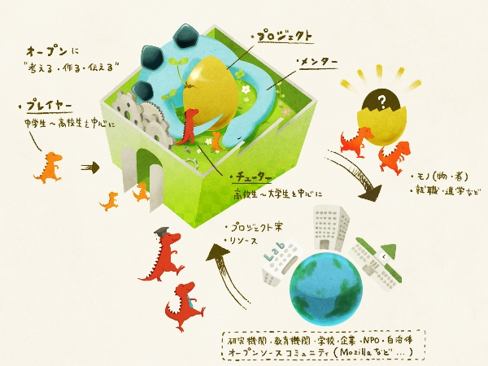
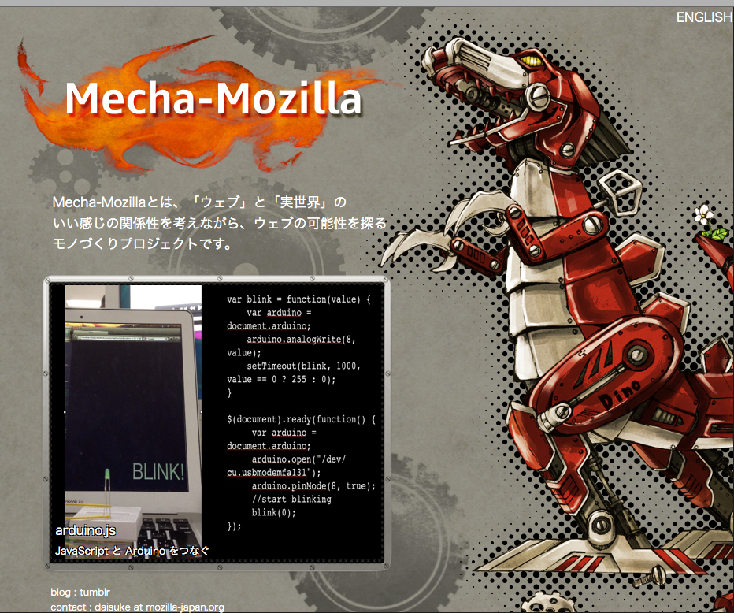
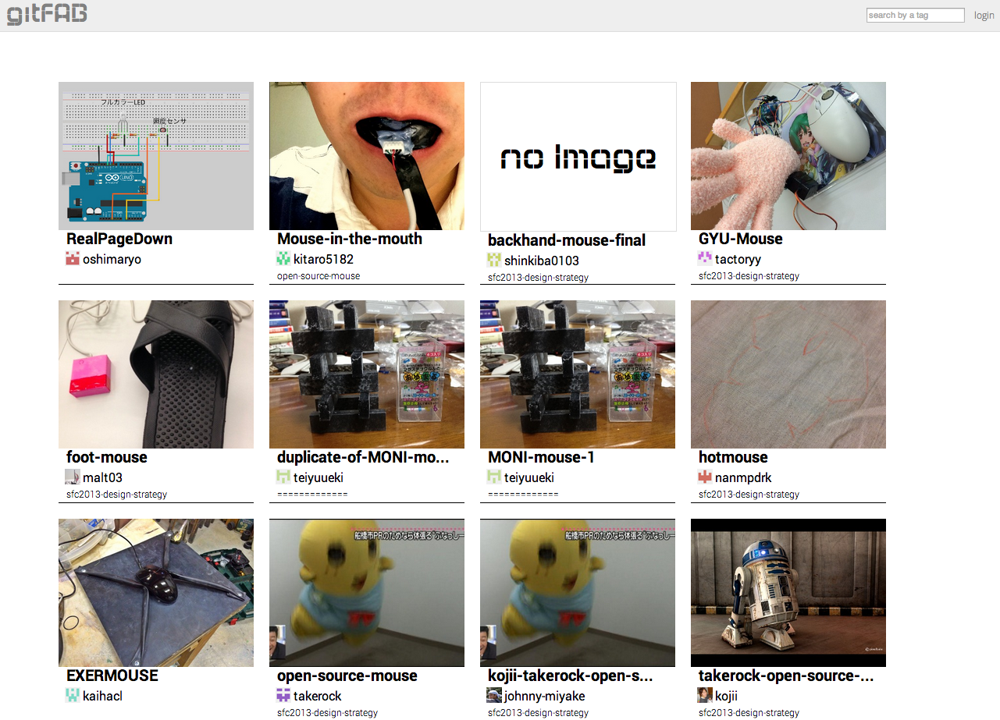
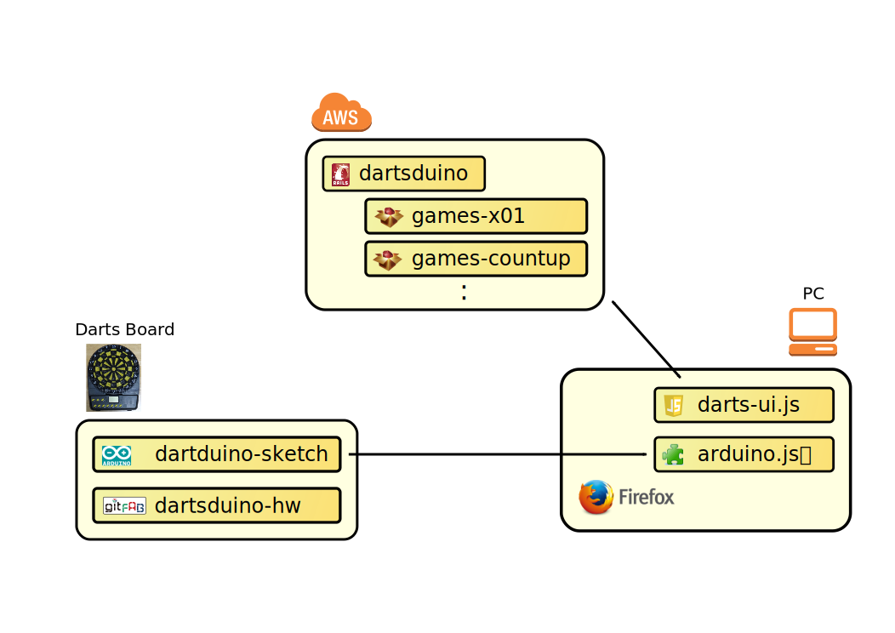
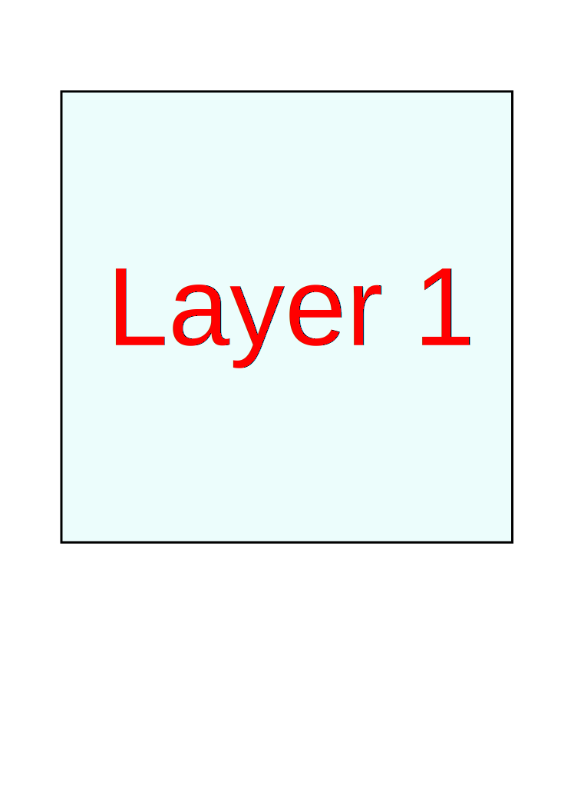
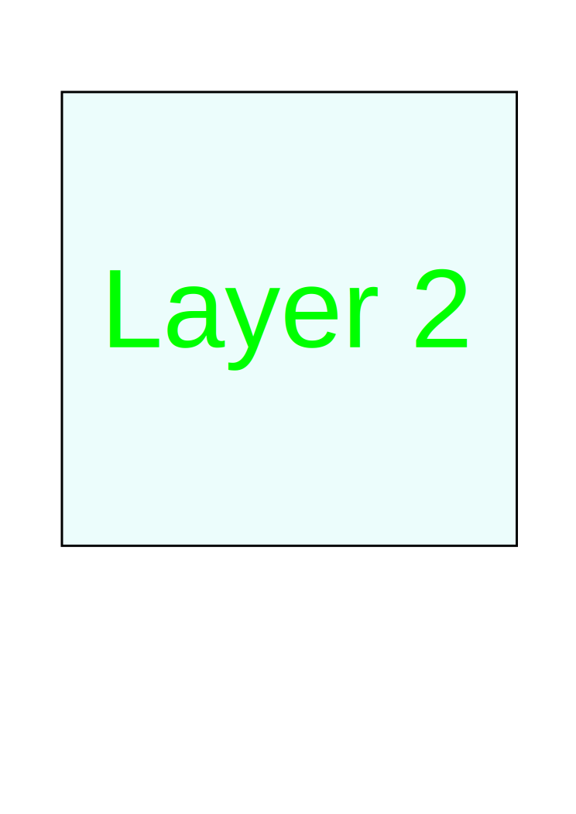
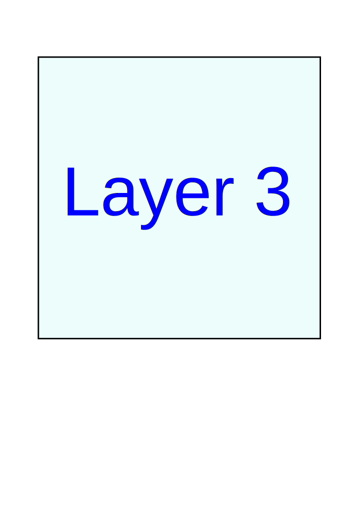

# dartsduino    <!-- class: "slide", id: "title" -->

  寺戸 育夫

## 自己紹介    <!-- class: "slide" -->

* 所属
* 関わった商品

  (※注 : 本件は、寺戸の個人的な活動や成果物を記したものであり、  寺戸が所属する会社とは一切関係ありません。)

## 背景    <!-- group: "zoom-test", class: "slide zoom-overview", dx: 0 -->

### Mozilla Factory    <!-- group: "zoom-test zoom-test-child", class: "slide zoom-item center", scale: 0.25, tx:  -280 -->

### Mecha-Mozilla   <!-- group: "zoom-test zoom-test-child", class: "slide zoom-item center", scale: 0.25 -->

### gitFAB    <!-- group: "zoom-test zoom-test-child", class: "slide zoom-item center", scale: 0.25, tx: 280 -->

##     <!-- group: "zoom-test", class: "zoom-overview", dx: 1500 -->

## dartsduino    <!-- class: "slide" -->

  <_iframe class="center" width="720" height="500" frameborder="0"
    src="http://www.youtube.com/embed/sHt_5in-ziQ">
  <_/iframe>

## 全体構成    <!-- class: "slide overview-item", dx: 0 -->

##    <!-- group: "overview", tx: -240, ty: 120, scale: 0.4 -->

##    <!-- group: "overview", tx: 240, ty: 120, scale: 0.4 -->

##    <!-- group: "overview", tx: 10, ty: -120, scale: 0.4 -->

##    <!-- group: "overview", dx: 1500 -->

## 3D Layers Test    <!-- class: "slide layers-3d", dx: 0 -->

##     <!-- group: "layers-test", class: "layers-3d", z: 100, rotate-x: -70, rotate-y: -45 -->

  
  
  

##     <!-- group: "layers-test", id: "layers-detail" -->
